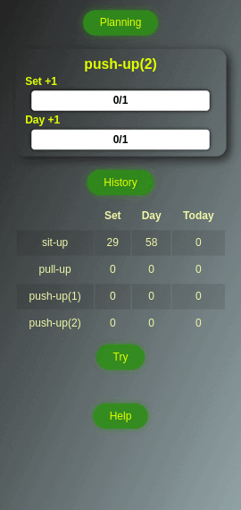
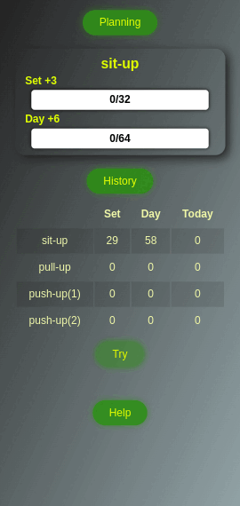
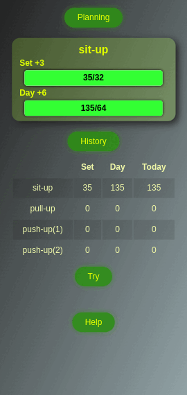

# Highscores

This project is a web application designed to manage and display high scores for various sports. Users can view today's scores, historical data, and manage their sports planning.

## Features

-   View today's scores

-   Access historical data

-   Manage sports planning

-   Add or delete sports

-   Settings for growth percentage

## Installation

1. Clone the repository:

    ```bash
    git clone https://github.com/gijs-d/Highscores.git
    ```

2. Navigate to the project directory:
    ```bash
    cd Highscores
    ```
3. Open index.html in your web browser.

### Android App

1. Download the `highscores.apk` file from the repository or your preferred location.

2. Enable installation from unknown sources on your Android device:

    - Go to **Settings** \> **Security** \> **Install unknown apps**.

    - Select the app (e.g., your file manager or browser) and enable **Allow from this source**.

3. Locate the downloaded `highscores.apk` file on your device.

4. Tap on the APK file to install the app.

5. Open the app to start managing your sports scores.

## Screenshots





